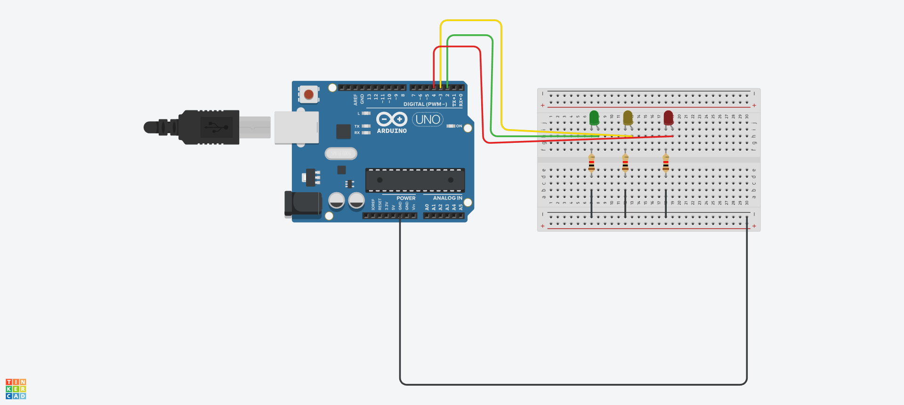

# Minecraft integrated with Arduino


## Description
This project is a simple example of how to integrate Minecraft with Arduino. The project uses the Bukkit API + SerialComm to interact with the board and the Arduino IDE to load the sketch in board.

## Requirements
 - Spigot server (1.20.1)
 - Arduino IDE (to load sketch to the board)
 - Arduino board (I used an Arduino Uno)

## Materials
 - 3 LED (Red, Green, Blue)
 - 3 Resistor (1k ohms)
 - Jumper wires
## How to use
1. Mount the circuit using the following schematic

2. Start the Spigot server (Change source code to serial port, this default is /dev/ttyACM0, used in Linux)

## How to build this project
1. Clone the repository using the command
```bash
git clone https://github.com/LMS5413/MinecraftArduino
```

2. Execute the command to build the project
```bash
./gradlew build
```